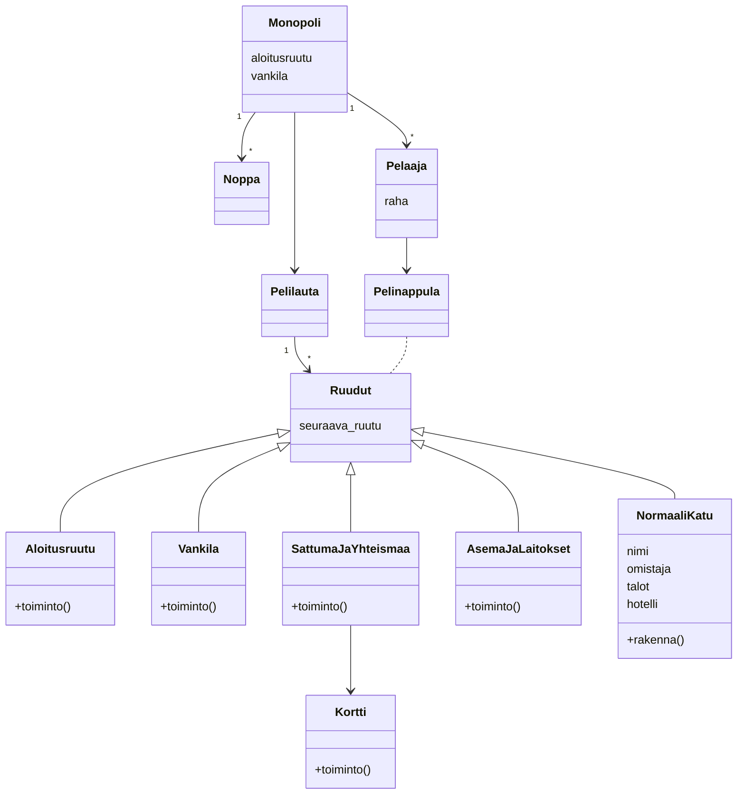

```mermaid
classDiagram
    Monopoli "1" --> "*" Noppa
    Monopoli "1" --> "*" Pelaaja
    Pelaaja  -->  Pelinappula
    Monopoli -->  Pelilauta
    Pelilauta "1" --> "*" Ruudut
    Pelinappula .. Ruudut
    Ruudut  <|-- Aloitusruutu
    Ruudut <|-- Vankila
    Ruudut <|-- SattumaJaYhteismaa
    Ruudut  <|-- AsemaJaLaitokset
    Ruudut  <|-- NormaaliKatu
    SattumaJaYhteismaa --> Kortti
    class Monopoli{
      aloitusruutu
      vankila
    }
    class Ruudut{
          seuraava_ruutu
      }
     class Pelaaja{
            raha
            }
    class Aloitusruutu{
      }
    Aloitusruutu : +toiminto()
    class Vankila{
      }
    Vankila : +toiminto()
    class SattumaJaYhteismaa{
      }
    SattumaJaYhteismaa : +toiminto()
    class AsemaJaLaitokset{
      }
    AsemaJaLaitokset : +toiminto()
    class NormaaliKatu{
        nimi
        omistaja
        talot
        hotelli
      }
    NormaaliKatu : +rakenna()
    class Kortti{
    }
    Kortti : +toiminto()
```
