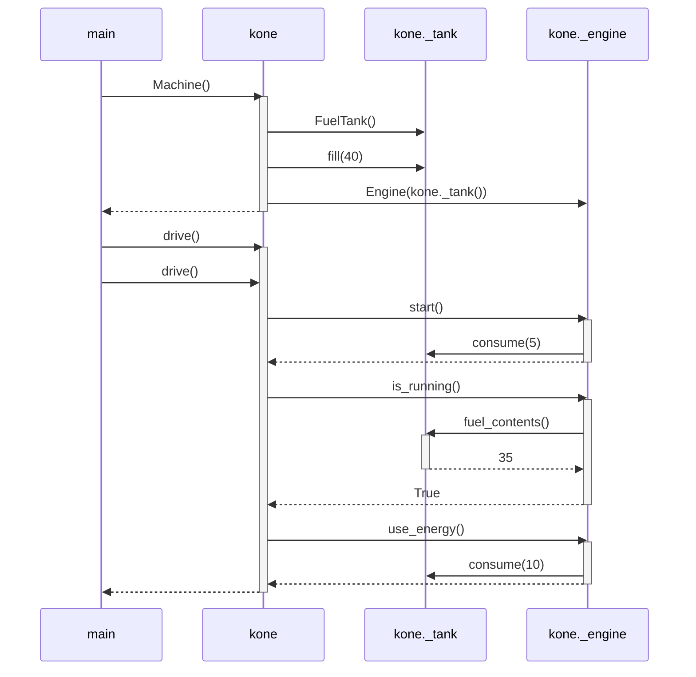

```mermaid
sequenceDiagram
    main->> kone: Machine()
    activate kone
    kone->> kone._tank: FuelTank()
    kone ->> kone._tank: fill(40)
    kone ->> kone._engine: Engine(kone._tank())
    kone -->> main:  
    deactivate kone
    main->>kone: drive()
    activate kone
    main ->> kone: drive()
    kone ->> kone._engine: start()
    activate kone._engine
    kone._engine ->> kone._tank: consume(5)
    kone._engine -->> kone:   
    deactivate kone._engine
    kone ->> kone._engine: is_running()
    activate kone._engine
    kone._engine ->> kone._tank: fuel_contents()
    activate kone._tank
    kone._tank -->> kone._engine: 35
    deactivate kone._tank
    kone._engine -->> kone: True
    deactivate kone._engine
    kone ->> kone._engine: use_energy()
    activate kone._engine
    kone._engine ->> kone._tank: consume(10)
    kone._engine -->> kone:  
    deactivate kone._engine
    kone -->> main:   
    deactivate kone
```
